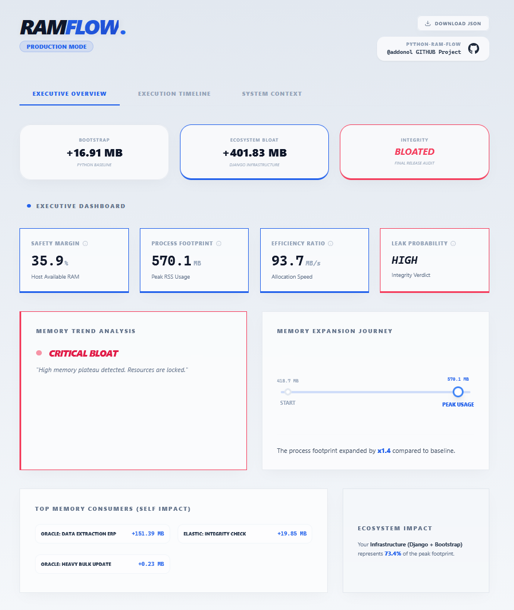
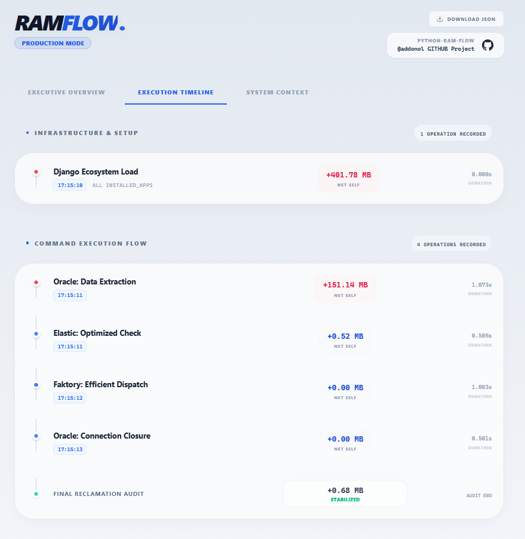
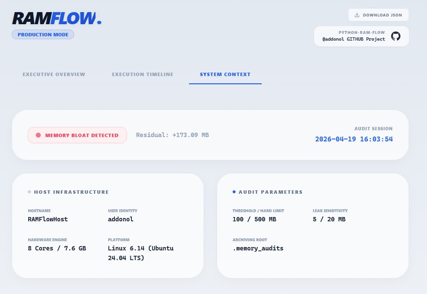

# RAM-FLOW 🌊

**A high-precision, real-time memory flow tracker and stress-tester for Python.**
Monitor RAM consumption per function call with premium dashboards, visual execution timelines, and safety circuit breakers.

In modern Python applications (Django, FastAPI, Celery), it is incredibly easy to accidentally **explode host resources**.

A forgotten global cache, an unfiltered database cursor, or a heavy model loaded into memory can create a "Silent Bloat". While your script might seem to run fine once, it leaves behind a residual footprint. In a long-running worker environment, these small leaks accumulate until they trigger a catastrophic **Out-Of-Memory (OOM) crash**, potentially taking down your entire host.

**RAM-FLOW** was built to detect these breakers before they reach production, giving you a surgical view of the memory lifecycle.

---


## Table of Contents
1. [Overview](#-overview)
2. [Technical Concepts](#-technical-concepts)
3. [Quick Start](#-quick-start)
4. [KPI Glossary](#-executive-dashboard-kpi-glossary)
5. [Configuration & Calibration](#️-configuration--calibration)
6. [Deep Dive: Advanced Auditing](#-deep-dive-advanced-auditing)
7. [Story-Driven Scenarios](#-story-driven-scenarios-demos)
8. [Automated Archiving](#-automated-audit-archiving)

## Overview
**RAM-FLOW** is designed for developers managing memory-intensive tasks (Oracle DB extractions, heavy data processing, long-running workers). Unlike standard profilers, it provides a surgical view of the memory lifecycle, distinguishing between environment overhead and business logic impact.

<details>
  <summary>📸 <b>Click to view Interface Screenshots</b></summary>
  <br>
  <p align="center">
    <a href="assets/01-dashboard-v1.png"></a><br>
    <a href="assets/02-timeline-v1.png"></a><br>
    <a href="assets/03-context-v1.png"></a>
  </p>
</details>


### Key Features
*   **Net Self-Memory Tracking**: Identify exactly which function allocates RAM by excluding children's consumption.
*   **Ecosystem Bloat Audit**: Measure the specific impact of heavy frameworks like Django before your code execution.
*   **Executive Scorecard**: Instant KPIs on peak footprint, expansion ratios, and host safety margins.
*   **Automated Audit Archiving**: Smart naming engine for historical performance tracking.
*   **Premium Reporting**: Generates standalone, "Platinum Silk" style HTML reports with built-in trend analysis and interactive tooltips.
*   **Safety Kill Switch**: Automated process termination if memory exceeds defined hard limits.


## Technical Concepts

To effectively debug memory issues, RAM-FLOW distinguishes between three distinct stages of allocation.

1.  **Bootstrap (Core Python)**: Memory used by the interpreter and standard libraries before RAM-FLOW starts. This is your absolute baseline.
2.  **Infrastructure Bloat (Ecosystem)**: Memory consumed while loading frameworks (Django `INSTALLED_APPS`, Models, heavy ML libraries). This often represents 200MB+ before any logic runs.
3.  **Execution Flow**: The weight of your actual business logic (e.g., Oracle data records).


### The Truck Metaphor
Imagine you are preparing a truck for a delivery:
*   **Bootstrap**: The weight of the `empty truck` (engine and chassis).
*   **Django Bloat**: The weight of the `shelves, tools, and GPS` installed inside.
*   **Execution Flow**: The weight of the `actual packages` you are delivering (e.g., Oracle data).


## 🚀 Quick Start

### Installation
```bash
uv add ram-flow
# or pip install ram-flow
```

## Integrated Usage
```python
from ramflow import tracker

# 1. Capture infrastructure load
tracker.log_django_bootstrap()

@tracker.track("Oracle Data Extraction")
def process_data():
    # Your heavy logic here
    pass

# 2. Run and Generate
process_data()
tracker.generate_report(suffix="nightly_sync")
```

## 📊 Executive KPIs
*   **Safety Margin**: Host RAM availability. Below 10% risks an OS OOM-Killer crash.
*   **Process Footprint**: The Peak RSS usage. Essential for container sizing (Docker).
*   **Efficiency Ratio**: Allocation speed (MB/s). Identifies "greedy" logic vs. efficient code.
*   **Leak Probability**: The final integrity verdict (Low/Medium/High) to ensure stability.


## Configuration & Calibration

Adjust the sensitivity of the `Leak Probability` using environment variables to account for natural memory fragmentation.


| Level | Range (Default) | Impact on Report |
| :--- | :--- | :--- |
| **Low** | `< 5 MB` | **SECURE** badge (Green) |
| **Medium** | `5 - 20 MB` | **STABLE-ISH** (Orange) - Possible fragmentation |
| **High** | `> 20 MB` | **BLOATED** (Red) - Active Leak detected |

```bash
export RAMFLOW_LEAK_MEDIUM=15
export RAMFLOW_LEAK_HIGH=50
```

## 🔍 Deep Dive: Advanced Auditing

RAM-FLOW provides more than just raw data; it offers a methodology to understand the hidden layers of Python memory management.

<details>
  <summary><b>Why does the Final Audit differ from the sum of tasks?</b></summary>
  <br>

It is normal for the <b>Residual Leak</b> to be slightly higher than the sum of <b>Net Self</b> tasks.

*   **Execution Tree (Net Self)**: Measures the surgical impact of your specific function code to find the culprit.
*   **Final Reclamation Audit**: The "System Truth". It includes runtime overhead (logs, buffers) and **C-Level Allocations** (like `oracledb` or `pandas` internal buffers) not visible to Python's high-level Garbage Collector.

**Where do the "missing MBs" come from?**
1. **Runtime Overhead**: Logging activities and small object instantiations between tracked functions.
2. **Memory Fragmentation**: Python's allocator may keep "free" pages for itself "just in case" instead of returning them to the OS.
3. **C-Level Buffers**: Libraries written in C often manage their own memory outside of Python's direct GC control.
</details>

<details>
  <summary><b>Threshold (Alerting) vs. Leak Probability (The Verdict)</b></summary>
  <br>

It is vital to distinguish between a **Heavy Task** and a **Memory Leak**.

1.  **The Threshold**: Highlights specific functions in your execution tree. A red line means the task is **heavy**, not necessarily broken.
2.  **Leak Probability**: Focused solely on the **Residual Memory** after your script finishes.


| Residual Leak | Verdict | Meaning |
| :--- | :--- | :--- |
| **< 2 MB** | **Low** | Perfect reclamation. |
| **2 - 10 MB** | **Medium** | Minor residues (caches or fragmentation). |
| **> 10 MB** | **High** | **Critical risk**. Large objects are stuck in RAM. |

> **Note**: Even if your Threshold is 1000MB, a leak of 80MB is **High**. If run in a worker 100 times, it will leak 8GB and crash your server (OOM).
</details>

<details>
  <summary><b>The Oracle "Double-Lock" Trap</b></summary>
  <br>

Memory in database operations is often held in two places:
1.  **Driver Level**: Internal buffers released only via `db.close_connection()`.
2.  **Application Level**: The Python variables (lists/dicts) storing the results.

**RAM-FLOW** shows if your process remains **BLOATED** even after closing the connection because you forgot to clear the local Python variables holding the data.
</details>

<details>
  <summary><b>Handling Negative Leak Values</b></summary>
  <br>

During the final audit, Python may release background objects allocated *before* the tracker started, resulting in a negative delta. **RAM-FLOW stabilizes these to `0.00 MB`** to represent a **Perfect Reclamation State** and ensure report clarity.
</details>

---
**Summary**: The **Execution Tree** tells you *where to optimize*, while the **Final Audit** tells you *if your worker is safe* for long-term production.


## Automated Audit Archiving

**RAM-FLOW** features an intelligent naming engine designed for high-frequency environments. It prevents overwriting by creating unique, timestamped audit trails.

### 🏗️ Naming Convention
Reports follow a standardized, sortable pattern:
`YYYYMMDD_HHMMSS_{ENV}_{SUFFIX}.html`

### ⚙️ Configuration
*   **Default**: Reports are stored in `.memory_audits/` at your project root.
*   **Environment Override**: Change the destination globally for your server:
    ```bash
    export RAMFLOW_REPORTS_DIR=/var/log/ramflow
    ```
*   **Script Override**: Define a custom folder or suffix on-the-fly:
    ```python
    tracker.generate_report(folder="logs/sync", suffix="oracle_export")
    # Output: logs/sync/20260419_153005_production_oracle_export.html
    ```

> **Pro-Tip**: This traceable footprint is vital for **Post-Mortem Analysis**, allowing you to compare memory trends across different days or deployments.


## 📖 Story-Driven Scenarios (Interactive Demos)

RAM-FLOW includes two fictitious, educational scenarios. These "Flight Simulations" illustrate common memory pitfalls and their professional solutions.

### 🔴 The Case of the Forgotten Search Cache
*The scenario of a "Silent Bloat" that kills production workers.*

*   **The Story**: A sync engine pulls 5,000 records from Oracle and queries ElasticSearch. To "optimize," the developer saves **unfiltered** ES results into a global cache but forgets to clear the reference.
*   **The Verdict**: RAM-FLOW detects a **High Memory Plateau**. Even if subsequent tasks use 0 MB, the report triggers a **CRITICAL BLOAT** alert.
*   **Run**:
    ```bash
    uv run examples/demo_forgotten_cache.py
    ```

### 🟢 The Triumph of the Optimized Pipeline
*The scenario of a "Lean Engine" ready for high-frequency scaling.*

*   **The Story**: The same engine, but upgraded with surgical `_source` filtering and an explicit `.clear()` call once the data is processed.
*   **The Verdict**: RAM-FLOW confirms the "Aircraft" is empty and stabilized. The report is issued with a **CERTIFIED LEAK-FREE** badge.
*   **Run**:
    ```bash
    uv run examples/scenario_clean_execution.py
    ```

> **Note**: Comparing these two reports is the best way to train your team on memory lifecycle management.
